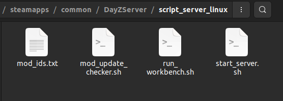

# DayZ Server Manager For Linux (with GUI)


Over the past few months, I've been dedicating myself to both managing a simple server on Linux and making some mods. For now, this guide will be server-only.

# Start server
Below is a script that I use to start my server, where I define a folder where all my mods will be (/md) and the server is restarted every 6 hours.


- File: start_server.sh 

```
#!/bin/bash

# ===== CONFIGURATION =====
PROTON_DIR="$HOME/.steam/steam/steamapps/common/Proton 9.0 (Beta)"
PROTON_RUN="$PROTON_DIR/proton"
SERVER_DIR="$HOME/.steam/steam/steamapps/common/DayZServer"
SERVER_EXE="DayZServer_x64.exe"
SCRIPT_DIR="$SERVER_DIR/script_server_linux"
MOD_ID_FILE="mod_ids.txt"

SERVER_MODS='-serverMod=servermod'
SERVER_PORT='-port=2302'
SERVER_CPU='-cpuCount=2'
SERVER_OTHERS='-dologs -adminlog -netlog -freezecheck'

CONFIG="-config=serverDZ.cfg"
PROFILES="-profiles=profiles"

# ===== PREPARE MOD LIST =====
MODS_SUBDIR="mods/"

if [ ! -f "$SCRIPT_DIR/$MOD_ID_FILE" ]; then
    echo "❌ File mod_ids.txt not found!"
    exit 1
fi

MODS_ID=$(<"$SCRIPT_DIR/$MOD_ID_FILE")
MODS_ID="${MODS_ID//\"/}"  # Remove quotes
MODS_ID="${MODS_ID// /}"   # Remove spaces
MODS_ID="${MODS_ID//$'\n'/}"  # Remove newlines
MODS_ID="${MODS_ID//$'\t'/}"  # (Optional) Remove tabs

MODS_PARAM_TEMP=""
IFS=';' read -ra IDS <<< "$MODS_ID"
for id in "${IDS[@]}"; do
    MODS_PARAM_TEMP+="${MODS_SUBDIR}${id};"
done

if [[ -z "$MODS_PARAM_TEMP" ]]; then
    echo "⚠️ No mod was loaded, check the mod_ids.txt file"
    exit 1
fi

# ===== Remove last semicolon =====
MODS_PARAM_TEMP="${MODS_PARAM_TEMP::-1}"

MODS="-mod=${MODS_PARAM_TEMP}"
echo "✅ All mods have been formatted."

# ===== PREFIX AND REQUIRED VARIABLES =====
STEAM_COMPAT_DATA_PATH="$HOME/.steam/steam/steamapps/compatdata"
STEAM_COMPAT_CLIENT_INSTALL_PATH="$HOME/.steam/steam"

export STEAM_COMPAT_DATA_PATH
export STEAM_COMPAT_CLIENT_INSTALL_PATH

# ===== CLEANUP LOGS =====
echo "🧹 Deleting .RPT, .log and .mdmp files in: $SERVER_DIR/profiles"
rm -f "$SERVER_DIR"/profiles/*.RPT "$SERVER_DIR"/profiles/*.ADM "$SERVER_DIR"/profiles/*.log "$SERVER_DIR"/profiles/*.mdmp
echo "✅ Cleanup completed."

# ===== EXECUTION =====
cd "$SERVER_DIR" || { echo "❌ Could not enter server directory."; exit 1; }

echo "🚀 Starting DayZ server with Proton..."
"$PROTON_RUN" run "./$SERVER_EXE" $CONFIG $PROFILES "$MODS" "$SERVER_MODS" "$SERVER_PORT" "$SERVER_CPU" "$SERVER_OTHERS" &

SERVER_LAUNCH_PID=$!

if ! kill -0 "$SERVER_LAUNCH_PID" 2>/dev/null; then
    echo "❌ Failed to start server with Proton."
    exit 1
fi

# Wait a bit for the process to start
sleep 5

# Capture all real process PIDs (children of Proton)
SERVER_PIDS=$(pgrep -u "$USER" -f "$SERVER_EXE")

# Check if PID was successfully captured
if [[ -n "$SERVER_PIDS" ]]; then
    echo "✅ Server started with PIDs: $SERVER_PIDS"
else
    echo "❌ Could not capture the server PID."
fi

# ===== TIME UNTIL NEXT RESTART =====

# Get current hour and minute
nowHour=$((10#$(date +%H)))
nowMin=$((10#$(date +%M)))

echo "Current time: $nowHour:$nowMin"

# Convert current time to minutes since midnight
totalNowMins=$((nowHour * 60 + nowMin))
echo "Minutes since midnight: $totalNowMins"

# Restart interval (every 6 hours = 360 minutes)
interval=360

# Calculate next restart time in minutes since midnight
nextRestart=$(( (totalNowMins / interval + 1) * interval ))

# Adjust for end of day (1440 minutes)
if [ "$nextRestart" -ge 1440 ]; then
    nextRestart=1440
    echo "Adjusting to midnight restart: $nextRestart"
fi

# Calculate remaining minutes until next restart
waitMins=$((nextRestart - totalNowMins))
echo "Remaining minutes: $waitMins"

# Convert to seconds
waitSecs=$((waitMins * 60))
echo "Next restart in $waitMins minutes ($waitSecs seconds)."

# Wait until next restart
sleep "$waitSecs"

# Shutdown processes (adjust based on real process name)
echo "Shutting down server..."

if [[ -n "$SERVER_PIDS" ]]; then
    echo "🛑 Shutting down the following PIDs: $SERVER_PIDS"
    kill $SERVER_PIDS
    sleep 2
    for pid in $SERVER_PIDS; do
        if ps -p "$pid" > /dev/null; then
            kill -9 "$pid"
        fi
    done
else
    echo "⚠️ No server process found to terminate."
fi

echo "$(date +%T) Server restarting..."

# Wait 10 seconds before restarting
sleep 10

# ===== Restart =====
exec "$SCRIPT_DIR/start_server.sh"

```

Below is a shortcut to run the server start script. This shortcut can be placed on the desktop and then executed with just two clicks. Note: You'll need to update your .desktop file to match the path to the start_server.sh script.


- File: start_server.desktop
```
[Desktop Entry]
Name=Start Server
Comment=Executar script .sh
Exec=gnome-terminal -- bash -c "~/.steam/steam/steamapps/common/DayZServer/script_server_linux/start_server.sh; exec bash"
Icon=utilities-terminal
Terminal=true
Type=Application
```

# Mod update checker
I also created a script to check from time to time if there has been an update to any mod, and if so, I will be notified on my server's discord channel.

- File: mod_update_checker.sh 
```
#!/bin/bash

# ===== CONFIGURATION =====
SERVER_DIR="$HOME/.steam/steam/steamapps/common/DayZServer"
SCRIPT_DIR="$SERVER_DIR/script_server_linux"
MOD_ID_FILE="mod_ids.txt"

MODS_ID=$(<"$SCRIPT_DIR/$MOD_ID_FILE")
MODS_ID="${MODS_ID//\"/}"  # Remove quotes
MODS_ID="${MODS_ID// /}"   # Remove spaces
MODS_ID="${MODS_ID//$'\n'/}"  # Remove line breaks
MODS_ID="${MODS_ID//$'\t'/}"  # (Optional) Remove tabs

IFS=';' read -ra IDS <<< "$MODS_ID"

WEBHOOK_URL="" # add your discord webhook URL here
CACHE_FILE="$HOME/.cache/dayz_mods_update_check"
mkdir -p "$(dirname "$CACHE_FILE")"
touch "$CACHE_FILE"

echo "🚀 Starting continuous check for Steam Workshop mod updates..."
echo "⏱️ Interval: every 10 minutes"
echo "📅 Start: $(date)"
echo "------------------------------------------"

while true; do
    echo "🔄 Checking for updates... ($(date))"
    
    for id in "${IDS[@]}"; do
    	[[ -z "$id" ]] && continue  # skip empty entries (like the last one)
    	
        MOD_URL="https://steamcommunity.com/sharedfiles/filedetails/?id=$id"
        
        HTML=$(curl -s "$MOD_URL")

        # Extract mod name
        MOD_NAME=$(echo "$HTML" | grep -oP '<div class="workshopItemTitle">.*?</div>' | sed -e 's/<[^>]*>//g' | xargs)

        # Extract last updated date
        UPDATED_DATE=$(echo "$HTML" | grep -oP '<div class="detailsStatRight">.*?</div>' | sed -e 's/<[^>]*>//g' | sed -n '3p' | xargs)

        # Convert date to Unix timestamp
        if [[ -n "$UPDATED_DATE" ]]; then
            UPDATED_DATE_EN=$(echo "$UPDATED_DATE" | sed -e 's/jan\./Jan/' -e 's/fev\./Feb/' -e 's/mar\./Mar/' -e 's/abr\./Apr/' \
                                              -e 's/mai\./May/' -e 's/jun\./Jun/' -e 's/jul\./Jul/' -e 's/ago\./Aug/' \
                                              -e 's/set\./Sep/' -e 's/out\./Oct/' -e 's/nov\./Nov/' -e 's/dez\./Dec/')

	    # Remove commas and "@"
	    UPDATED_DATE_CLEAN=$(echo "$UPDATED_DATE" | sed -E 's/,//g; s/@//g' | xargs)

	    # If the year is already present
	    if [[ "$UPDATED_DATE_CLEAN" =~ [0-9]{4} ]]; then
	        DATE_TO_PARSE="$UPDATED_DATE_CLEAN"
	    else
	        CURRENT_YEAR=$(date +%Y)
	        # Move time to the end: e.g. "28 Feb 8:02am" -> "28 Feb 2025 8:02am"
	        DATE_TO_PARSE=$(echo "$UPDATED_DATE_CLEAN $CURRENT_YEAR" | awk '{print $1, $2, $4, $3}')
	    fi

	    # Convert to timestamp
	    MOD_TIMESTAMP=$(date -d "$DATE_TO_PARSE" +%s 2>/dev/null)
        
        else
            MOD_TIMESTAMP=0
        fi
        
        # Check if conversion was successful
	if [[ -z "$MOD_TIMESTAMP" ]]; then
	    echo "⚠️ [$id] $MOD_NAME — Failed to convert date: '$UPDATED_DATE' (processed: '$DATE_TO_PARSE')"
	fi

        # Load saved timestamp
        LAST_TIMESTAMP=$(grep "^$id:" "$CACHE_FILE" | cut -d: -f2)

        # Update check
        if [[ -z "$LAST_TIMESTAMP" ]]; then
            echo "📌 [$id] $MOD_NAME — First check, updated on: $UPDATED_DATE"
            if [[ "$MOD_TIMESTAMP" -gt 0 ]]; then
	        echo "$id:$MOD_TIMESTAMP" >> "$CACHE_FILE"
	    fi
        elif [[ "$MOD_TIMESTAMP" -gt "$LAST_TIMESTAMP" ]]; then
            echo "✅ [$id] $MOD_NAME — HAS BEEN UPDATED! New date: $UPDATED_DATE"
            sed -i "s/^$id:.*/$id:$MOD_TIMESTAMP/" "$CACHE_FILE"

            # Send Discord notification
            curl -s -X POST "$WEBHOOK_URL" \
                -H "Content-Type: application/json" \
                -d @- <<EOF
{
  "username": "DayZ Mod Watcher",
  "content": "🧩 **Mod updated!**\n📌 Name: **$MOD_NAME**\n🆔 ID: \`$id\`\n📅 Updated on: $UPDATED_DATE\n🔗 $MOD_URL\n@everyone"
}
EOF
        else
            echo "⏸️ [$id] $MOD_NAME — No changes since: $UPDATED_DATE"
        fi

        sleep 2  # Delay between requests
    done

    echo "🕔 Waiting 10 minutes until next check..."
    echo "------------------------------------------"
    sleep 600
done

```

I've also created a shortcut to run the update checker script. This shortcut can be placed on your desktop and run with just two clicks. Note: You'll need to update your .desktop file to match the path to the mod_update_checker.sh script.

- File: checker_update.desktop

```
[Desktop Entry]
Name=Update Checker
Comment=Executar script .sh
Exec=gnome-terminal -- bash -c "~/.steam/steam/steamapps/common/DayZServer/script_server_linux/mod_update_checker.sh; exec bash"
Icon=utilities-terminal
Terminal=true
Type=Application
```

# Mods id

To simplify the project, all mods are in one folder, rather than at the project root. Similarly, to keep track of which mods are active and which ones I need to load and verify, I created a mod_ids.txt file to centralize its usage for all scripts in use.


```
3484013890;
2646817942;
2030913708;
2143128974;
1870524790;
1710977250;
1827241477;
3325269593;
1559212036;
1646187754;
3094539419;
2545327648;
2276010135;
2792982069;
2291785308;
3427626164;
2828486817;
1828439124;
1797720064
```

# Script bot for Discord

I wrote a python script for a discord bot, which aims to monitor the server status, as well as the number of players online, and this information is displayed in the bot's status.


```
import discord
import asyncio
import a2s

TOKEN = ""
SERVER_ADDRESS = ("177.xxx.xxx.234", 27016)

intents = discord.Intents.default()
client = discord.Client(intents=intents)

async def update_status():
    while True:
        try:
            info = a2s.info(SERVER_ADDRESS, timeout=3.0)
            online_players = info.player_count
            max_capacity = info.max_players
            server_name = info.server_name

            status_msg = f"✅ {online_players}/{max_capacity} - {server_name[:40]}"
            await client.change_presence(activity=discord.Game(name=status_msg))

        except Exception as e:
            print(f"Error fetching server info: {e}")
            await client.change_presence(activity=discord.Game(name="❌ Server offline"))

        await asyncio.sleep(60)

@client.event
async def on_ready():
    print(f'Bot connected as {client.user}')
    client.loop.create_task(update_status())

client.run(TOKEN)
```

- prerequisite for the script:
```
- pip install -U discord.py
- pip install python-a2s
- python3 bot.py
```



# References:

[complementary guide](https://steamcommunity.com/sharedfiles/filedetails/?id=3434068549)
